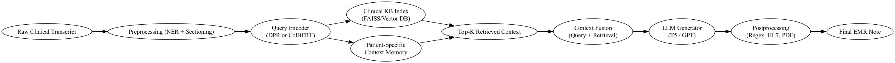

This document outlines the design of a Retrieval-Augmented Generation (RAG) system tailored for generating structured EMR (Electronic Medical Record) notes from raw clinical transcripts. It is divided into three main sections: Data Sources, System Architecture, and Evaluation & Optimization.

---

## 1. 🔍 Data Sources for Retrieval

To support the generation of clinically accurate and contextually grounded EMR notes from transcripts, the system should retrieve information from a blend of domain-specific and patient-specific sources. Clinical guidelines such as those from UpToDate, NICE, or the NIH are invaluable for grounding assessments and plans in current evidence-based standards. These resources help ensure that suggested treatments or diagnoses are aligned with best practices and reduce the risk of hallucinated content.

Medical ontologies like SNOMED CT, ICD-10, and UMLS provide the standardized terminology needed for interoperable EMR notes. Integrating these into the retrieval pipeline ensures that symptoms, diagnoses, and procedures are labeled using consistent, machine-readable vocabularies. This is especially important for downstream systems like billing, clinical decision support, or research databases.

Patient-specific history is another crucial input. Retrieving prior encounter notes, lab results, medication lists, and chronic conditions provides valuable context that not only helps tailor the generated note to the patient but also avoids redundant documentation. It can also help the system disambiguate between new complaints and ongoing issues. In addition to this, retrieving a corpus of prior EMR notes from similar encounters—filtered by presenting symptoms, diagnosis, or demographics—can guide the model in producing stylistically and structurally consistent outputs.

Finally, embedding example SOAP templates into the retriever helps nudge the generation phase toward expected clinical formats. This reduces formatting drift and reinforces the tone, structure, and professional rigor required in EMR documentation. Together, these data sources build a rich, modular foundation for Retrieval-Augmented Generation in the clinical domain.

---

## 2. 🏗️ System Architecture

Below is the high-level architecture of the proposed RAG system:

This architecture uses a combination of preprocessing, retrieval from external knowledge bases and patient-specific memory, followed by fusion and LLM-based generation. The final postprocessing ensures that the EMR note is clean, structured, and ready for downstream use.

# 🩺 RAG System Components for EMR Generation

### 1. **Raw Clinical Transcript**
The initial input: a free-form, often unstructured conversation between provider and patient. It includes valuable clinical and contextual information but requires preprocessing.

### 2. **Preprocessing (NER + Sectioning)**
Named Entity Recognition identifies clinical concepts (e.g., symptoms, medications). Sectioning uses rules or regex to break the transcript into meaningful units like Subjective and Objective.

### 3. **Query Encoder (DPR or ColBERT)**
Transforms the segmented transcript into a dense vector using semantic encoders. Enables meaning-based retrieval over exact keyword matching.

### 4. **Clinical Knowledge Index (FAISS/Vector DB)**
A pre-built vector index of medical knowledge (guidelines, notes) enables quick retrieval of top-K relevant documents to support the generation task.

### 5. **Patient-Specific Context Memory**
Fetches prior EMR data (e.g., diagnoses, labs) relevant to the current patient. This ensures personalization and prevents repetition of known information.

### 6. **Top-K Retrieved Context**
Combines and filters context from clinical KB and patient memory. The resulting context is clean, concise, and maximally relevant for grounding the output.

### 7. **Context Fusion (Query + Retrieval)**
Fuses the original transcript with retrieved passages to create the full input prompt. May include prompt compression or reranking to fit token limits.

### 8. **LLM Generator (T5 or GPT)**
A sequence-to-sequence model generates the EMR note, guided by the fused context. The prompt encourages SOAP formatting and clinical tone.

### 9. **Postprocessing (Regex, HL7, PDF)**
Applies formatting cleanup, validation, and export. Converts Markdown output into HL7, JSON, or PDF as needed for EMR systems.

### 10. **Final EMR Note**
Produces a complete, clinically grounded EMR note that’s structured, accurate, and ready for provider review or EMR integration.

---

## 3. 📏 Evaluation and Optimization

Evaluating a RAG-based EMR generation system requires a layered approach, considering both the quality of retrieved content and the faithfulness of the generated output. At the retrieval level, we want to ensure that the documents being surfaced are relevant, non-redundant, and clinically appropriate. This can be assessed using traditional retrieval metrics like recall@k and semantic similarity, but also through domain-specific filtering — for instance, verifying whether retrieved guidelines actually match the presenting complaint or diagnosis.

At the generation level, the most important metric is faithfulness: is the generated note consistent with both the transcript and the retrieved context? In a clinical setting, hallucinated medications, misrepresented symptoms, or fabricated findings are unacceptable. Evaluation frameworks like RAGAS help quantify this by assessing the grounding of generated outputs in the input context. Other important metrics include structural completeness (ensuring all SOAP sections are present), clinical relevance (does the note match the intent of the transcript?), and terminology accuracy (are standard codes used when applicable?).

Human-in-the-loop review remains essential, particularly in the early stages. Feedback from clinicians can help identify subtle errors, style violations, or dangerous oversights that automated metrics may miss. Over time, these reviews can inform prompt refinement, better chunking strategies, or fine-tuning of retrievers and generators.

Optimization is an iterative process. We might adjust the retriever to include or exclude certain document types, compress prompts more efficiently, or experiment with reranking methods to prioritize more contextually rich passages. Generation can be improved through prompt engineering, contrastive fine-tuning, or structured decoding methods that reinforce SOAP compliance. The ultimate goal is a system that balances scalability with safety, and automation with accountability.
