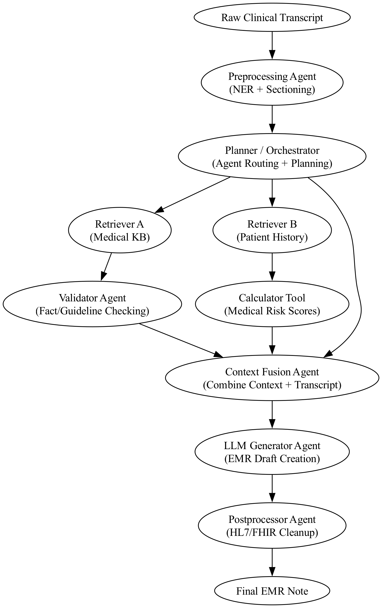

This document outlines a modular and agentic architecture for converting clinical transcripts into detailed EMR notes using Large Language Models (LLMs), tool-use APIs, and planning agents. It builds upon the principles discussed in Singh et al. (2025).

---

## 1. 🛠 Tool Selection

The system equips the LLM agent with the following tools:

- **Medical Knowledge Bases**: UMLS, SNOMED CT, UpToDate for factual grounding
- **Search APIs**: PubMed or Google Health to retrieve current literature
- **Structured Data Extractors**: Med7, ScispaCy for entity recognition
- **Patient Record Access**: For chronic history, medication list, and labs
- **Medical Calculators**: CHADS2, creatinine clearance, BMI, etc.
- **Validation Scripts**: HL7/FHIR compliance and logic checks
- **Code Execution**: For computing results, logical operations, etc.

These tools allow agents to both reason and verify dynamically while maintaining EMR compliance and clinical accuracy.

---

## 2. 🏗 System Architecture

The system consists of modular, specialized agents that collaborate through a planner. Each agent has a well-defined role and can use tools as needed.

### Agent Roles:

- **Planner/Orchestrator**: Decomposes tasks and selects tools/agents
- **Retriever Agents**: Fetch domain-specific or patient-specific context
- **Validator Agent**: Ensures that retrieved content is accurate and complete
- **Calculator Tool**: Computes scores based on clinical formulae
- **Fusion Agent**: Merges transcript and retrievals into a prompt
- **Generator Agent**: Uses LLM to draft the SOAP/EMR note
- **Postprocessor Agent**: Formats the output for HL7/FHIR compatibility

This setup enables compositional, verifiable generation of structured medical documentation.

---

## 3. 📏 Evaluation and Optimization

### Automatic Evaluation:

- **Faithfulness Metrics** (e.g., RAGAS): Measures alignment between output and retrieved context
- **Structural Completeness**: Are all required EMR fields covered?
- **FHIR/HL7 Compliance**: Is the format machine-parseable?
- **BLEU/ROUGE Scores**: Compared to reference notes if available

### Human-in-the-loop Evaluation:

- **Clinical Reviewer Panel**: Doctors evaluate factuality, risk, and usability
- **Error Categorization**: Understand why/where the agent failed
- **Evaluator Agent**: Can suggest automatic corrections or re-routing

### Optimization Loop:

- Logs from agent decisions are stored and analyzed
- Reflection agents fine-tune prompts or retrieval strategies
- Distillation or fine-tuning is used to compress workflows into smaller, cheaper models

This loop ensures continuous improvement with both human feedback and system self-awareness.
---